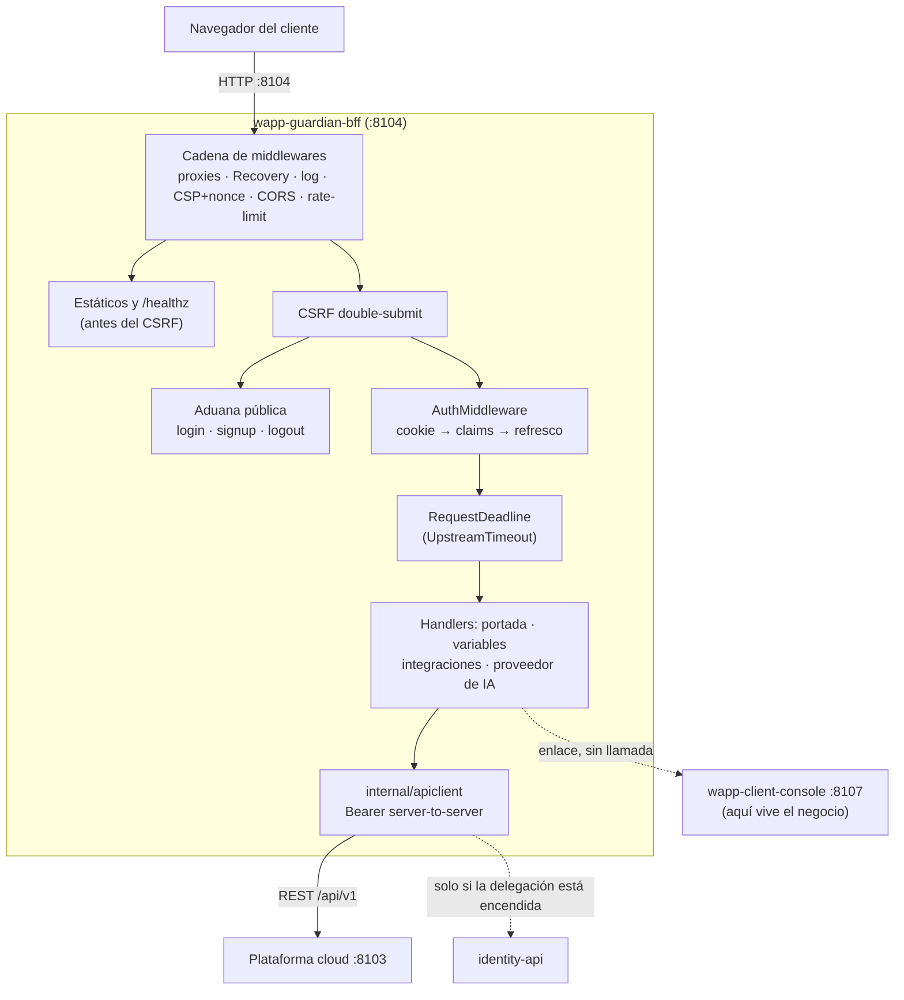
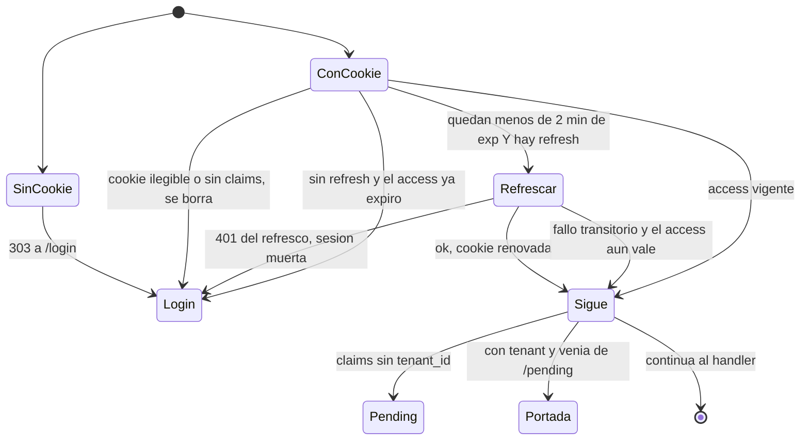
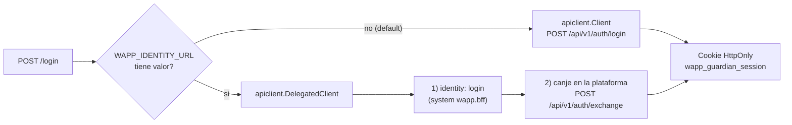

# Arquitectura de `wapp-guardian-bff`

Cómo está hecha la pieza por dentro. Verificado sobre el commit `26e84c9` (2026-08-30).

---

## 1. La forma en una frase

Un monolito web pequeño de **cuatro paquetes Go**, sin base de datos y sin estado propio: recibe una
petición HTTP del navegador, la pasa por una cadena de middlewares de `wapp-shared/web`, y el
handler que corresponda **relaya server-to-server** contra la API pública REST de la plataforma con
el Bearer que saca de la cookie. Lo que devuelve es HTML renderizado en el servidor.

**3.957 líneas** de producción y **6.715** de test: el ratio es de **1,7:1 a favor de los tests**, y
eso es intencional — la mayor parte del valor de este repo está en los candados (ver la §4 de
[`constitucion.md`](constitucion.md)).

---

## 2. Capas

| Capa | Dónde | Qué decide |
|---|---|---|
| **Arranque** | `cmd/guardian-bff` + `internal/bootstrap` | Lee el entorno, fija el logger, valida lo que vive fuera del proceso (JWKS) y levanta un `http.Server` endurecido. Es donde el proceso decide **no nacer** si algo está mal. |
| **Configuración** | `internal/config` | Traduce entorno a `Config`. **No lee ficheros ni red**; un solo `Load()`. |
| **Web (el núcleo)** | `internal/web` | Router, orden de middlewares, handlers, puertos, plantillas y CSS. 26 ficheros de producción. |
| **Cliente de la API** | `internal/apiclient` | El único que sabe hablar HTTP con la plataforma y con identity. Traduce estados a errores con nombre (`ErrUnauthorized`, `APIError`, `RejectionError`). |

La dirección de dependencia es estricta y de una sola vía: `cmd` → `bootstrap` → `web` →
`apiclient` → `config`. `apiclient` **no importa** `web`; el acoplamiento va por las interfaces de
`internal/web/port.go`, que las define el consumidor.

---

## 3. Mapa de paquetes y ficheros

```
cmd/guardian-bff/main.go        45 líneas · el único main. Produce el binario `guardian-bff`
internal/config/config.go      193 líneas · Config ← entorno (prefijo WAPP_). Cobertura 100 %
internal/bootstrap/
  server.go                     composition root: verificador JWKS → router → http.Server → apagado graceful
  identity.go                   construye (o no) el verificador de Identity Tokens. Fail-closed
internal/web/            🧠     el núcleo
  server.go              341 l  EL REGISTRO DE RUTAS y el orden exacto de los middlewares
  integrations_handler.go 514 l pantalla del puente CRM + contadores de la cola outbox
  tenantllm_handler.go   451 l  pantalla del proveedor de IA (vía local|api, consentimiento)
  tenantvariables_handler.go 294 l pares clave→valor del tenant
  auth_handler.go        281 l  login/logout, AuthMiddleware, refresco proactivo y pasivo, withAuthRetry
  port.go                139 l  las interfaces segregadas (Authenticator, HomeAPI, IntegrationsManager…)
  signup_handler.go      123 l  alta pública + pantalla /pending
  entitlements.go         99 l  vista de plan/features y el gate fail-closed
  handlers.go             87 l  composición: elige cliente legacy o delegado según entorno
  home_handler.go         77 l  LA PORTADA (GET /)
  policy.go               64 l  nombres de cookie de ESTE BFF y opciones de los middlewares del módulo
  session.go              34 l  ParseUnverified de los claims y extracción del exp
  render.go               29 l  envoltorio de webgin.NewRenderer("base.html")
  templates/layouts/      base.html (88 líneas) — el ÚNICO layout
  templates/pages/        7 ficheros: login, signup, pending, home, tenant-variables, integrations, tenant-llm
  static/css/app.css     275 l  design system propio, embebido
internal/apiclient/     1.011 l  transport.go (196), integrations.go (200), tenantllm.go (169),
                                 auth.go (163), delegated.go (145), tenantvariables.go (106),
                                 entitlements.go (60), client.go (24)
```

**Por dónde empezar a leer siempre: `internal/web/server.go`.** Es el registro de rutas, el orden
de los middlewares y —lo más valioso— el sitio donde cada retirada de la mudanza dejó escrito qué se
fue, a dónde y qué test lo vigila (`:178-197`, `:235-244`, `:246-256`, `:265-281`, `:283-296`).

---

## 4. Punto de entrada y binario

**Uno solo.** `cmd/guardian-bff/main.go` produce el binario `guardian-bff` (en UAT se instala como
`/usr/local/bin/wapp-guardian-bff`). No acepta flags: no hay `flag.Parse()` ni lectura de `os.Args`,
así que **`-version` no existe** y el binario arranca ignorándolo. La única forma fiable de saber
qué commit corre un binario es `go version -m <binario>`, que lee el `vcs.revision` empotrado.

Cadena de arranque, verificada:

```
main()
 └─ config.Load()                                   main.go:19   entorno → Config
 └─ slog.SetDefault(...)                            main.go:24-31  JSON si Environment != "local"
 └─ bootstrap.Run(&cfg)                             main.go:39
     └─ signal.NotifyContext(SIGINT, SIGTERM)       bootstrap/server.go:17
     └─ ServeWithContext
         ├─ newIdentityVerifier(cfg)                bootstrap/server.go:33  ⛔ FAIL-CLOSED
         ├─ web.NewRouterWithLimiter(cfg)           bootstrap/server.go:37
         ├─ http.Server endurecido                  bootstrap/server.go:42
         └─ bloquea; al recibir señal, Shutdown con ShutdownTimeout
```

Lo que se **registra en ejecución** en el arranque, y con qué regla:
- `consola BFF iniciada` con `addr`, `public_api` y `ambiente` (`main.go:33`).
- `delegación de identidad activada…` **solo si `WAPP_IDENTITY_URL` trae valor** (`handlers.go:63`).
- `modo dual de identidad activado…` **solo si `WAPP_IDENTITY_JWKS_URL` trae valor**
  (`bootstrap/identity.go:38`).
- `consola BFF escuchando` justo antes del `ListenAndServe` (`bootstrap/server.go:46`).
- Al apagar: `señal de apagado recibida, drenando peticiones en vuelo` y `consola BFF apagada
  limpiamente`.
- El formato lo decide el ambiente: **texto en `local`, JSON en cualquier otro**. En UAT el ambiente
  vale `local`, así que **el BFF loguea en texto donde las dos consolas hermanas loguean en JSON**
  (ver [`deuda.md`](deuda.md)).

---

## 5. El camino de una petición



Dos cosas que el diagrama hace explícitas:
- **Los estáticos y `/healthz` salen antes del CSRF**, para no ensuciar respuestas cacheables con
  una cookie de token. Ese orden no se toca.
- **La flecha hacia `wapp-client-console` es punteada porque no hay llamada**: el BFF solo pinta un
  enlace si `WAPP_GUARDIAN_CLIENT_CONSOLE_URL` trae valor. Las dos aplicaciones **no se hablan**.

---

## 6. Cómo decide el AuthMiddleware

Es la pieza con más ramas del repo (`internal/web/auth_handler.go:114-185`) y conviene tenerla en la
cabeza antes de tocarla:



Tres detalles que se olvidan:
1. **Un access ya expirado SÍ intenta refresco** — `RefreshDue` da `true` cuando falta menos del
   margen de 2 minutos, y un token vencido cumple de sobra. Solo cae al logout si **no hay refresh
   token**. Lo vigila `TestAuthMiddlewareExpiredAccessRefreshesAndContinues`
   (`auth_refresh_test.go:76`).
2. **El refresco va serializado por sesión** con `sharedweb.RefreshGroup` (single-flight): diez
   pestañas del mismo usuario producen **una** llamada de refresco
   (`TestAuthMiddlewareSingleFlight`, `auth_refresh_test.go:169`).
3. **Sin `tenant_id` la navegación queda secuestrada en `/pending`**, que es un callejón sin salida
   salvo «Cerrar sesión» (`auth_handler.go:171-181`). `wapp-client-console` hace lo contrario: deja
   entrar y ofrece canjear una invitación. Es una asimetría real entre las dos consolas.

---

## 7. Las dos vías de autenticación, en un vistazo



Los dos clientes cumplen **el mismo puerto `APIPort`** (`internal/web/port.go`, bloque de
verificación en compilación al final del fichero), y por eso encender la delegación **no obliga a
tocar ni un handler**: cambia quién autentica, no cómo se le pide. El **Identity Token no se
persiste**: muere dentro de `wapp-shared/iam` y la cookie custodia siempre el Context Token, que es
de donde sale el `tenant_id` (invariante B10 de la constitución).

---

## 8. Estado del proceso: qué hay y qué no

**No hay base de datos, ni fichero de estado, ni caché en disco.** Lo único que el proceso guarda,
todo en memoria y por proceso:

| Qué | Dónde | Vida |
|---|---|---|
| `KeyedRateLimiter` (mapa por IP o `user_id`) | `internal/web/server.go:99-107` | se libera al apagar (`server.go:335-339`); purga perezosa dentro de `Allow`, sin goroutine de barrido |
| `RefreshGroup` (single-flight del refresco) | `internal/web/handlers.go:67` | vida del proceso |
| Árbol de plantillas compilado | `internal/web/server.go:113-133` | **local a cada router**, no un global mutable: los tests montan routers en paralelo sin compartir estado |

Consecuencia operativa: **reiniciar el BFF no cierra ninguna sesión** (la sesión vive en la cookie
del navegador, no en el proceso), pero **sí vacía el rate-limit**.
